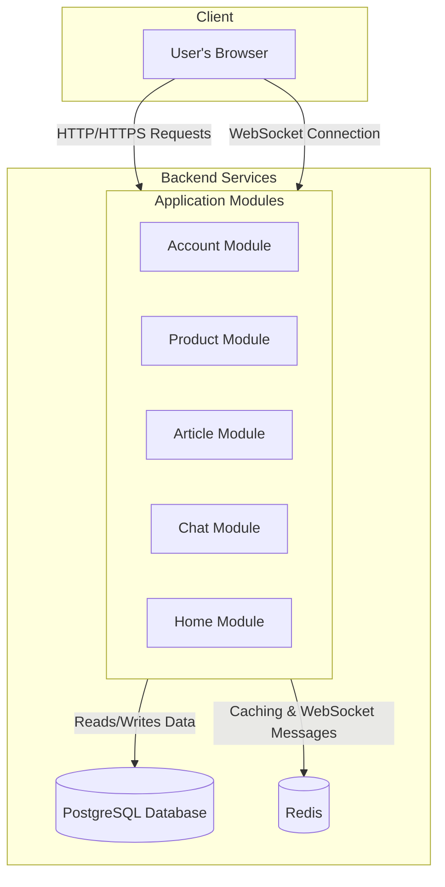

# Solution Architecture: Plant Shop

This document provides a comprehensive overview of the technical architecture for the Plant Shop application. It is intended for developers, architects, and technical managers.

## 1. High-Level Architecture

The Plant Shop is a **monolithic web application** built with the **Django framework**. It follows a traditional server-rendered model, where the backend handles business logic, data persistence, and renders HTML templates, which are then styled on the client-side using Tailwind CSS.

For real-time features like the chat, the application uses **Django Channels** to handle WebSocket connections, running on an **ASGI (Asynchronous Server Gateway Interface)** server.

The core design principles are:
*   **Modularity:** The application is divided into distinct Django "apps," each responsible for a specific domain (e.g., `product_module`, `account_module`).
*   **Simplicity:** A monolithic architecture was chosen over microservices to reduce deployment complexity and simplify development for a project of this scale.
*   **Scalability:** The architecture is designed to be stateless where possible, allowing it to be scaled horizontally by adding more application server instances.

## 2. Component Diagram

This diagram illustrates the main logical components of the application and their interactions.



### Component Descriptions

*   **User's Browser:** The client interface, responsible for rendering HTML/CSS and managing user interactions.
*   **Plant Shop Django Application:** The core of the system. It's a single Django project containing all the business logic.
    *   **Account Module:** Manages user registration, login, profiles, and authentication.
    *   **Product Module:** Handles the e-commerce functionality, including product catalogs, categories, shopping cart, and order processing.
    *   **Article Module:** A content management system for blog posts and articles.
    *   **Chat Module:** Powers the real-time chat feature using Django Channels.
    *   **Home Module:** Serves the main landing pages and static content.
*   **PostgreSQL Database:** The primary data store for all persistent data, such as user accounts, products, orders, and articles.
*   **Redis:** A multi-purpose in-memory data store used for:
    1.  **Caching:** Caching database queries and rendered template fragments to improve performance.
    2.  **Session Storage:** Storing user session data.
    3.  **Message Broker:** Facilitating real-time communication between WebSocket connections for Django Channels.

## 3. Deployment Diagram (Production)

This diagram shows a recommended deployment setup for a production environment, designed for scalability and reliability.

```mermaid
graph TD
    subgraph "Internet"
        Client[User's Browser]
    end

    subgraph "Cloud Server / VPS"
        direction TB
        Nginx[Nginx Web Server] --> AppGroup[Application Group] & StaticFiles[/static & /media]

        subgraph AppGroup
            direction LR
            Gunicorn[Gunicorn WSGI Server] --> Daphne[Daphne ASGI Workers]
        end

        subgraph "Data Services"
            Postgres[(PostgreSQL)]
            RedisCache[(Redis)]
        end

        Daphne --> Postgres
        Daphne --> RedisCache
    end

    Client -- Port 80/443 --> Nginx

    Nginx -- Serves directly --> StaticFiles
    Nginx -- Reverse Proxy HTTP (port 8000) --> Gunicorn
    Nginx -- Reverse Proxy WebSocket (/ws/) --> Daphne
```

*   **Nginx:** Acts as a reverse proxy, SSL terminator, and serves static files (`/static/`) and user-uploaded media (`/media/`) directly for high performance.
*   **Gunicorn:** A battle-tested WSGI server that manages synchronous web requests.
*   **Daphne:** An ASGI server that handles asynchronous requests, specifically for WebSocket connections managed by Django Channels.
*   **PostgreSQL & Redis:** Run as separate services, ideally on dedicated instances or managed services for high-availability production environments.

## 4. Sequence Diagram: New User Registration

This diagram details the process flow when a new user signs up.

```mermaid
sequenceDiagram
    participant Browser
    participant DjangoApp as Django Application
    participant DB as PostgreSQL Database

    Browser->>+DjangoApp: GET /user/register/
    DjangoApp->>-Browser: Respond with Registration Form (HTML)

    Browser->>+DjangoApp: POST /user/register/ (with form data)
    DjangoApp->>DjangoApp: Validate form data (e.g., check if email exists, password strength)
    alt Form is Valid
        DjangoApp->>+DB: CREATE User record in the database
        DB-->>-DjangoApp: Return new User ID
        DjangoApp->>DjangoApp: (Optional) Dispatch task to send a verification email
        DjangoApp->>-Browser: Redirect to Login Page with a success message
    else Form is Invalid
        DjangoApp->>-Browser: Re-render Registration Form with validation errors
    end
```

## 5. Data Flow Overview

*   **User Data:** All user-generated data (profiles, orders, articles) follows a standard CRUD lifecycle. It enters through the Django application via forms, is validated, and is then persisted to the **PostgreSQL** database.
*   **Session Data:** User session information is stored in **Redis** to maintain state across requests without hitting the database.
*   **Cache Data:** To optimize performance, results from expensive database queries are temporarily stored in **Redis**. When a subsequent request for the same data is made, it is served from the cache, bypassing the database.
*   **Static Assets:** CSS, JavaScript, and image files are collected by Django's `collectstatic` command and served directly by **Nginx** in production.
*   **Media Files:** User-uploaded files (e.g., profile pictures, product images) are saved to the file system in the `/uploads/` directory and are also served directly by **Nginx**.
*   **Real-time Chat Data:** Chat messages are sent from the browser via a WebSocket to Django Channels. The message is then published to a **Redis** channel. All other users in the same chat room are subscribed to that channel and receive the message in real-time. The messages are also persisted to **PostgreSQL**.
