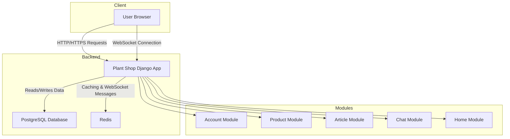
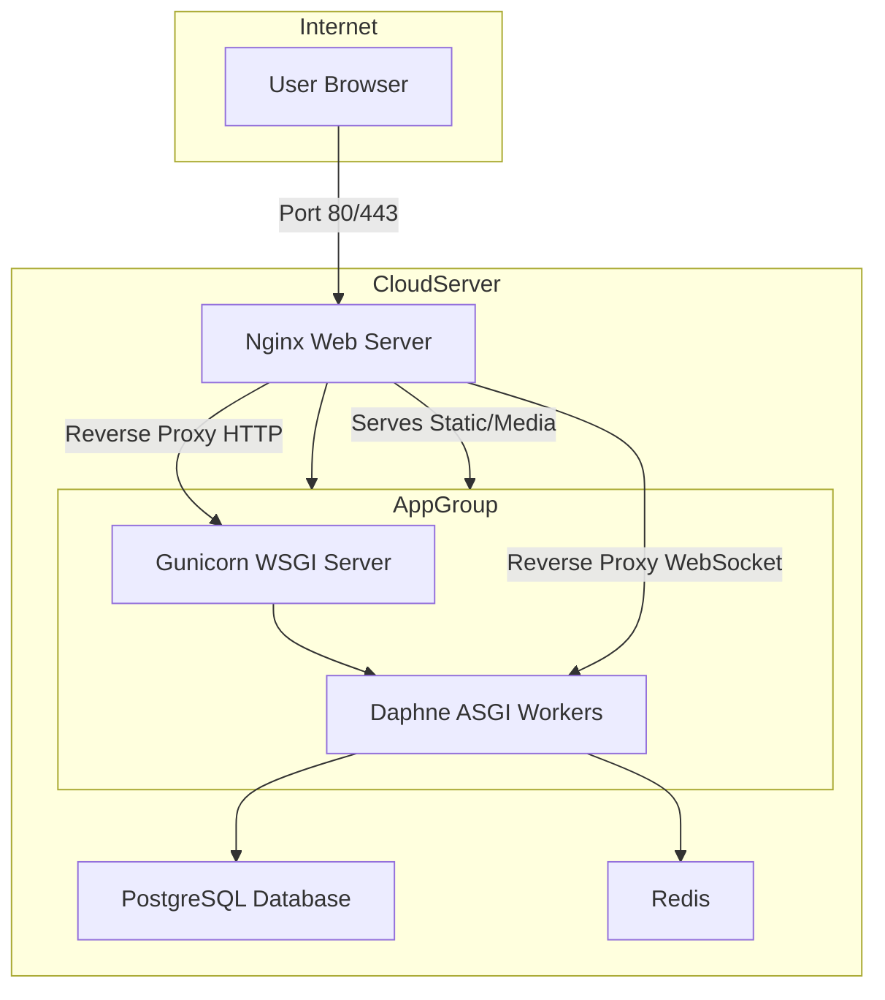
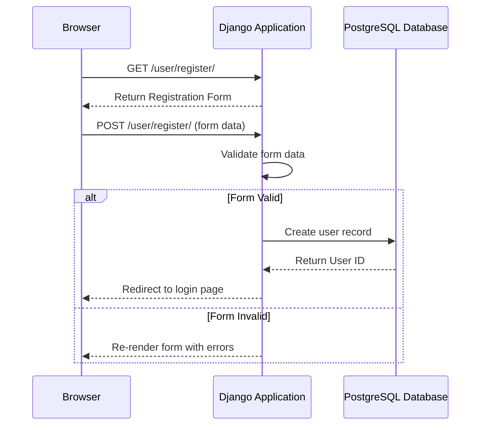

# Solution Architecture: Plant Shop

## 1. High-Level Architecture

The Plant Shop is a **monolithic web application** built with Django. It is server-rendered, with backend handling business logic, persistence, and HTML templates styled with Tailwind CSS.

Real-time chat uses Django Channels with an ASGI server.

**Core Principles:**

* **Modularity:** Separated into Django "apps" (product\_module, account\_module).
* **Simplicity:** Monolithic design reduces deployment complexity.
* **Scalability:** Stateless design allows horizontal scaling.

---

## 2. Component Diagram

**Component Descriptions:**

* **User Browser:** Renders HTML/CSS and manages interactions.
* **Plant Shop Django App:** Core system containing business logic.
* **Account Module:** User registration, login, profiles, auth.
* **Product Module:** Product catalog, cart, orders.
* **Article Module:** Blog posts and articles.
* **Chat Module:** Real-time chat via Django Channels.
* **Home Module:** Landing pages and static content.
* **PostgreSQL:** Stores all persistent data.
* **Redis:** Cache, session storage, message broker for WebSockets.

---

## 3. Deployment Diagram

**Notes:**

* **Nginx:** Reverse proxy, SSL terminator, serves /static/ and /media/.
* **Gunicorn:** Handles synchronous HTTP requests.
* **Daphne:** Handles WebSocket connections.
* **PostgreSQL & Redis:** Ideally separate services for high availability.

---

## 4. Sequence Diagram: User Registration

---

## 5. Data Flow Overview

* **User Data:** Entered via forms, validated, persisted to PostgreSQL.
* **Session Data:** Stored in Redis for stateless scaling.
* **Cache Data:** Expensive queries cached in Redis for improved performance.
* **Static Assets:** Served directly by Nginx.
* **Media Files:** User uploads saved in /uploads/ and served by Nginx.
* **Real-time Chat:** Messages sent via WebSocket → Django Channels → Redis channel → other users; also persisted in PostgreSQL.
