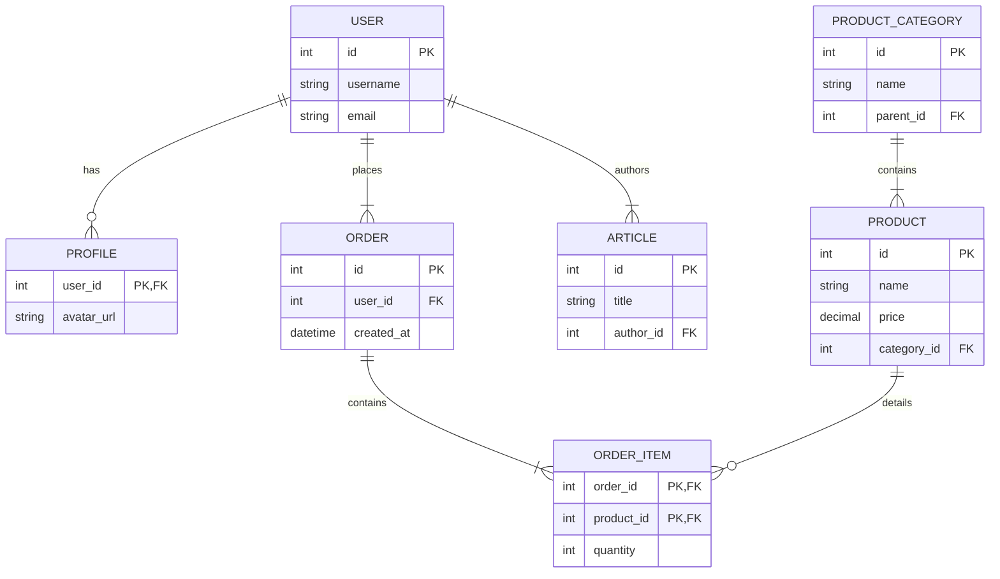

# Database Schema Overview

This document provides a high-level overview of the main database tables (represented as Django models) used in the Plant Shop application. The primary database is **PostgreSQL**, chosen for its robustness, reliability, and rich feature set.

## Core Concepts

*   **ORM:** The application uses the **Django ORM (Object-Relational Mapper)**, meaning that database tables are defined as Python classes (models) and queries are typically written in Python.
*   **Primary Keys:** By default, each model has an auto-incrementing `BigAutoField` named `id` that serves as its primary key.
*   **Relationships:** Standard relational concepts like one-to-one, one-to-many (ForeignKey), and many-to-many are used to link models.
*   **Timestamps:** Many models include `created_at` and `updated_at` fields (often via a base model or mixin) to automatically track record creation and modification times.

---

## `account_module`

Stores all data related to user accounts, profiles, and authentication.

*   **`User`**: This is the central model for authentication, inheriting from Django's `AbstractUser`.
    *   **Purpose:** Stores login credentials (`username`, `email`, hashed `password`) and basic user information.
    *   **Key Fields:** `username`, `email`, `first_name`, `last_name`, `is_active`, `is_staff`.
*   **`Profile`**: A supplementary model linked one-to-one with `User`.
    *   **Purpose:** Stores extended, non-authentication-related user data.
    *   **Key Fields:** `user` (OneToOneField), `bio`, `avatar` (ImageField).

---

## `product_module`

Contains all models essential for the e-commerce functionality.

*   **`ProductCategory`**: A hierarchical model for organizing products.
    *   **Purpose:** Allows for creating categories and sub-categories (e.g., "Indoor Plants" > "Foliage Plants").
    *   **Key Fields:** `name`, `slug`, `parent` (ForeignKey to self, managed by `django-mptt`).
*   **`Product`**: The core model representing an item for sale.
    *   **Purpose:** Stores all details about a specific plant.
    *   **Key Fields:** `name`, `slug`, `description`, `price`, `stock`, `image`, `category` (ForeignKey to `ProductCategory`).
*   **`Order`**: Represents a single transaction initiated by a user.
    *   **Purpose:** Acts as a header for a customer's purchase, linking the user to the items they bought.
    *   **Key Fields:** `user` (ForeignKey), `total_price`, `shipping_address`, `is_paid`, `status` (e.g., 'Processing', 'Shipped').
*   **`OrderItem`**: A line item within an `Order`.
    *   **Purpose:** Represents a specific product and quantity within an order.
    *   **Key Fields:** `order` (ForeignKey), `product` (ForeignKey), `quantity`, `price` (at time of purchase).
*   **`Tag`**: A generic tagging model provided by `django-taggit`.
    *   **Purpose:** Allows for flexible, non-hierarchical labeling of products (e.g., "low-light," "pet-safe").

---

## `article_module`

Manages the content for the blog and informational pages.

*   **`Article`**: The main model for a blog post.
    *   **Purpose:** Stores the content, author, and metadata of an article.
    *   **Key Fields:** `title`, `slug`, `content`, `author` (ForeignKey to `User`), `image`, `status` ('Draft', 'Published').
*   **`Comment`**: Represents a user comment on an article.
    *   **Purpose:** To store discussion related to an article.
    *   **Key Fields:** `article` (ForeignKey), `user` (ForeignKey), `text`, `created_at`.

---

## `chat_module`

Stores data for the real-time chat functionality.

*   **`ChatRoom`**: Represents a single chat conversation.
    *   **Purpose:** A container for messages between a user and an administrator or support agent.
    *   **Key Fields:** `user` (ForeignKey), `admin` (ForeignKey, optional), `status` ('Active', 'Closed').
*   **`ChatMessage`**: An individual message within a `ChatRoom`.
    *   **Purpose:** Persists the chat history.
    *   **Key Fields:** `room` (ForeignKey), `sender` (ForeignKey to `User`), `message`, `timestamp`.

---

## Conceptual Entity-Relationship Diagram

This diagram illustrates the primary relationships between the core models.

